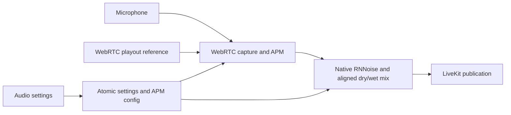

# Native microphone processing

RNNoise uses the Rust port [`nnnoiseless` 0.5.2](https://docs.rs/nnnoiseless/0.5.2/nnnoiseless/struct.DenoiseState.html),
with its bundled default model. The port is functionally compatible with the
RNNoise approach used by the JS AudioWorklet; bit-identical output to the WASM
build is not claimed.



AEC remains part of the original WebRTC processing and receives its render
reference there. AGC uses WebRTC's adaptive digital AGC2; it does not adjust the
hardware microphone volume. Built-in WebRTC noise suppression is disabled, so
RNNoise is the sole noise suppressor. Disabling RNNoise bypasses it entirely.
In native calls, decoded soundboard clips are mixed into WebRTC's render
pre-processing. They follow the selected voice output and become part of the
AEC reference. The bounded PCM payload crosses Tauri once per clip; realtime
frames remain in the native callback. Overlapping clips remain supported.

The callback handles 10 ms frames and independent channel state. Buffer
allocations occur at initialization (and RNNoise state reset when re-enabled),
not per frame. The same capture publishes scalar level telemetry for the local
speaking indicator, replacing its separate CPAL stream.

From `src-tauri`:

```sh
cargo test --offline -p sion-native-audio
cargo test --offline --features native-voice --lib native_audio
cargo test --offline --features native-voice --lib voice_
```

The first suite tests passthrough, aligned mixing and noise attenuation. The
second runs the actual C++/Rust capture APM at 16/32/48 kHz without audio hardware
or SFU access, including a simulated reapplication of contradictory SDK options.
Real speaker echo, device changes and mixed JS/Rust encrypted calls still
require interactive validation.
